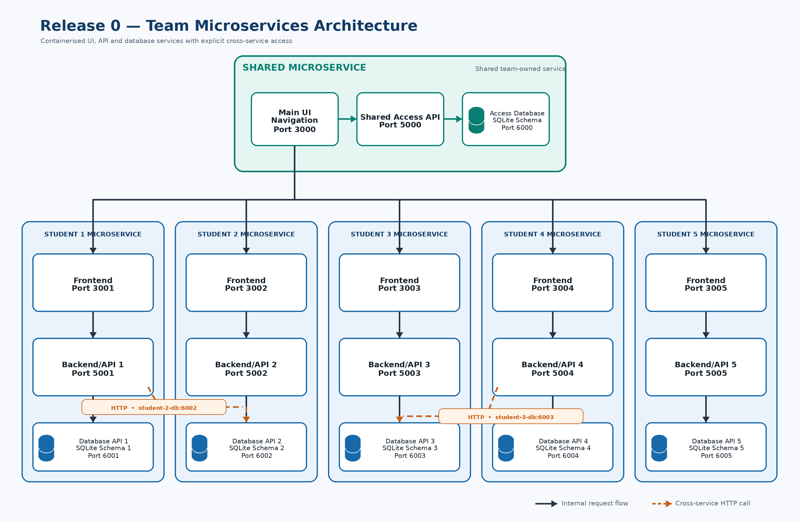

# Release 0 architecture



## Overview

LanguageWise is six independent microservices — one per team member, plus a team-owned
`shared` service — running together under a single Docker Compose configuration.

Every microservice is built the same way:

| Tier | Technology | Responsibility |
| --- | --- | --- |
| **Frontend** | nginx serving a static build | Renders the page. Contains **no** server-side code. |
| **Backend / API** | ASP.NET Core minimal API on .NET 10 | Business logic. Calls the database service over HTTP. |
| **Database service** | ASP.NET Core minimal API on .NET 10 + `Microsoft.Data.Sqlite` | The **only** process that opens the SQLite file. Exposes CRUD. |
| **Database** | SQLite file on a named Docker volume | Persists between restarts. |

Folders are named after the **feature** they deliver, not the student who owns them, so
the repository still reads correctly if ownership changes.

## Port map

| Microservice | Owner | Feature | Frontend | Backend | Database service |
| --- | --- | --- | --- | --- | --- |
| `shared` | Team | Unified home page | **3000** | 5000 | 6000 |
| `mini-games-service` | Kyan | Mini Games / Activities | **3001** | 5001 | 6001 |
| `chat-discussion-service` | Lachlan | Discussion / Chat Forum | **3002** | 5002 | 6002 |
| `quizzes-courses-service` | Justin | Quizzes and Courses | **3003** | 5003 | 6003 |
| `quests-achievements-notifications-service` | Amber | Quests / Achievements / Notifications | **3004** | 5004 | 6004 |
| `leaderboard-analytics-service` | Roan | Leaderboard / Analytics | **3005** | 5005 | 6005 |
| `ollama` | Team | LLM runtime | — | 11434 | — |

Inside the Docker network **every .NET container listens on 8080** and every nginx
container listens on 80. The numbers above are the *host* ports published by
Docker Compose, and they match the architecture diagram.

## Independence

This is the property the whole layout is designed around: **a microservice must build,
test, run and be reasoned about entirely on its own.** Concretely:

- Each service owns a `.slnx` solution, its own `.csproj` files with explicit package
  versions, its own tests, its own Dockerfiles and its own frontend assets.
- There is **no** repository-root `Directory.Build.props`, `Directory.Packages.props` or
  combined `.sln`. Nothing outside a service folder affects how it builds.
- Each Docker build context is a **single tier folder** (for example
  `./shared/backend`), so an image physically cannot read another microservice's files.
- Each service has its own CI workflow, so a red build points at exactly one service.
- Each service has its own SQLite database. No volume is shared.

The only things a service shares with the rest of the repository are the port
allocation above, the shape of the HTTP contracts below, and `docker-compose.yml`.
Cross-service communication, when it arrives, is HTTP over the shared Docker network —
never a project reference and never a shared database.

You can prove the isolation at any time:

```bash
docker build -t solo-db ./chat-discussion-service/database
docker build -t solo-be ./chat-discussion-service/backend
docker build -t solo-fe ./chat-discussion-service/frontend
```

None of these can see the repository root, and all three succeed.

### Frontend stacks may differ

Each microservice picks its own frontend technology. The only contract is that the
container serves the app on port 80 and proxies `/api/` to its own backend.

| Service | Frontend stack |
| --- | --- |
| `mini-games-service` | Vue 3 + Vite, built in a `node:22-alpine` stage |
| everything else | Static HTML, CSS and HTMX |

Because the Vue build happens inside the Dockerfile, nobody needs Node installed — not
teammates, not the CI runner.

## Request flow

```
Browser
   │  http://localhost:3003/
   ▼
quizzes-courses-service-frontend  (nginx :80)
   │  location /api/  ->  proxy_pass http://quizzes-courses-service-backend:8080
   ▼
quizzes-courses-service-backend   (ASP.NET Core :8080)
   │  HttpClient  ->  http://quizzes-courses-service-db:8080/api/items
   ▼
quizzes-courses-service-db        (ASP.NET Core :8080)
   │  Microsoft.Data.Sqlite
   ▼
/data/quizzes-courses-service.db  (named volume quizzes-courses-service-db-data)
```

### Why nginx proxies `/api/`

The browser only ever talks to one origin, so there is no CORS configuration to get
wrong and no hard-coded backend port in the HTML. The backend ports are still
published on the host, which makes them easy to test directly with `curl` or a REST
client during development.

nginx resolves the backend through Docker's embedded DNS server (`127.0.0.11`) using a
variable in `proxy_pass`. This is deliberate: with a literal upstream name nginx
resolves at start-up and refuses to boot if the backend container is not up yet. The
`$request_uri` suffix is required, because a variable `proxy_pass` does not rewrite the
path on its own.

## API contracts

### Database service — `http://localhost:600N`

Full CRUD over the `SampleItems` table.

| Method | Route | Response |
| --- | --- | --- |
| `GET` | `/health` | `200` with the row count, `503` if SQLite is unreachable |
| `GET` | `/api/items` | `200` — every item |
| `GET` | `/api/items/{id}` | `200` or `404` |
| `POST` | `/api/items` | `201` with the created item, `400` if `name` is missing |
| `PUT` | `/api/items/{id}` | `200` with the updated item, `404`, or `400` |
| `DELETE` | `/api/items/{id}` | `204` or `404` |

### Backend / API — `http://localhost:500N`

| Method | Route | Response |
| --- | --- | --- |
| `GET` | `/health` | `200` |
| `GET` | `/api/sample-items` | `200` JSON array, `503` if the database service is down |
| `GET` | `/api/sample-items/fragment` | `200` `text/html` — `<tr>` rows for HTMX |

The fragment endpoint exists because **HTMX swaps HTML, not JSON**. The JSON endpoint
is kept for API consumers, for non-HTMX frontends such as the Vue mini-games app, and
for the Release 1 AI services.

### Frontend — `http://localhost:300N`

| Route | Response |
| --- | --- |
| `/` | `index.html` |
| `/health` | `200` JSON — used by the container health check |
| `/api/*` | Reverse-proxied to the backend |

`mini-games-service` additionally falls back to `index.html` for unknown paths, because
its Vue router handles routes such as `/vocab-voyage` on the client.

## The `SampleItems` table

Identical in every database so that the skeleton is easy to follow. Each service seeds
ten rows relevant to its own feature, satisfying the ten-record minimum in
specification section 2.2.

```sql
CREATE TABLE IF NOT EXISTS SampleItems (
    Id          INTEGER PRIMARY KEY AUTOINCREMENT,
    Name        TEXT NOT NULL,
    Description TEXT NOT NULL DEFAULT '',
    CreatedAt   TEXT NOT NULL
);
```

Schema and seed live in `<service>/database/LanguageWise.<Name>.Db/sql/`. On start-up
the service applies `schema.sql` unconditionally (it is `IF NOT EXISTS`) and runs
`seed.sql` only when the table is empty, so a brand new volume always self-seeds and an
existing volume is never duplicated.

This table is a **placeholder**. Replace it with your feature's real schema — it exists
only to prove the wiring end to end.

## Docker Compose

19 containers, one bridge network (`languagewise`) and seven named volumes.

Ordering is enforced with `depends_on: { condition: service_healthy }`, so a backend
never starts before its database service reports healthy, and a frontend never starts
before its backend does. The health checks themselves live in the Dockerfiles, so they
apply however the image is started — including outside Compose.

Every build context is a single tier folder, and each tier carries its own
`.dockerignore` to keep host `bin/` and `obj/` output (which contains absolute Windows
paths) out of the Linux build.

### Ollama and port 11434

If you also run Ollama natively, it already owns port 11434 and the container will fail
to start. Override the host port:

```powershell
$env:OLLAMA_PORT = "11435"; docker compose up -d
```

Nothing inside the network changes — other containers always reach it at
`http://ollama:11434`.

## Cross-service calls

The dashed arrows on the diagram (for example `mini-games-service-backend` reading from
`chat-discussion-service-db`) are not implemented yet, but the topology already supports
them: all containers sit on the same network and can reach each other by container name,
e.g. `http://chat-discussion-service-db:8080/api/items`.

Call another service's **backend**, not its database service, and never its SQLite file.

## The CSS theme

`shared/frontend/css/theme.css` is the canonical copy of the look and feel
(specification section 2.3). Because each frontend build context is its own folder, the
file is **copied into** each service rather than referenced from a shared location.

That is a deliberate trade-off: full build isolation costs us automatic theme
consistency. When you change the theme, change it in `shared/frontend/css/theme.css` and
copy it out to the other services:

```powershell
'mini-games-service','chat-discussion-service','quizzes-courses-service',
'quests-achievements-notifications-service','leaderboard-analytics-service' |
    ForEach-Object { Copy-Item shared\frontend\css\theme.css "$_\frontend\css\theme.css" -Force }
```

`mini-games-service` uses Vue with its own component styles and does not consume
`theme.css`.
